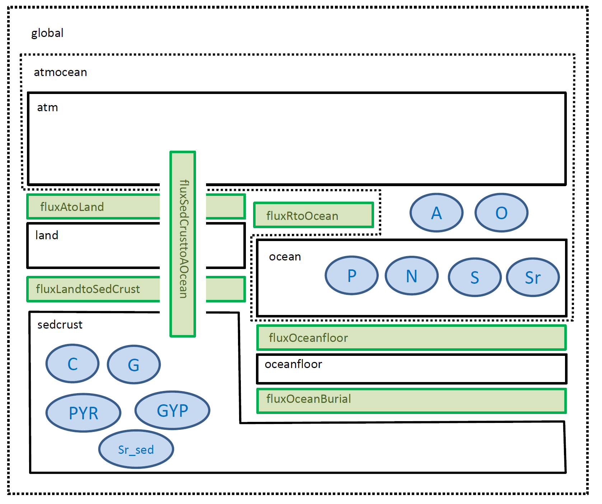

# PALEO COPSE Domains

The PALEO version of the COPSE Reloaded model is componentized into land, atmosphere, ocean, oceanfloor and sedcrust Domains with explicit transfer of biogeochemical fluxes between them ([Figure 1](@ref)), allowing the PALEO Reactions for each Domain to be reused to create a hierarchy of coupled models eg including a spatially-resolved ocean component.

The implementation is mathematically equivalent to the [Matlab version](https://github.com/sjdaines/COPSE) using for the paper ([Lenton2018](@cite)) and is tested against archived model output.

###### Figure 1
*PALEO COPSE reloaded model Domains (black), flux coupler Domains (green), and biogeochemical Reservoirs (blue). The 'atmocean' Domain contains the COPSE A and O Reservoirs, which represent combined atmosphere + ocean inorganic carbon and oxygen respectively. The 'global' Domain hosts Forcing Reactions, ReactionSum to check budgets, and a Reaction to calculate global mean temperature.*

